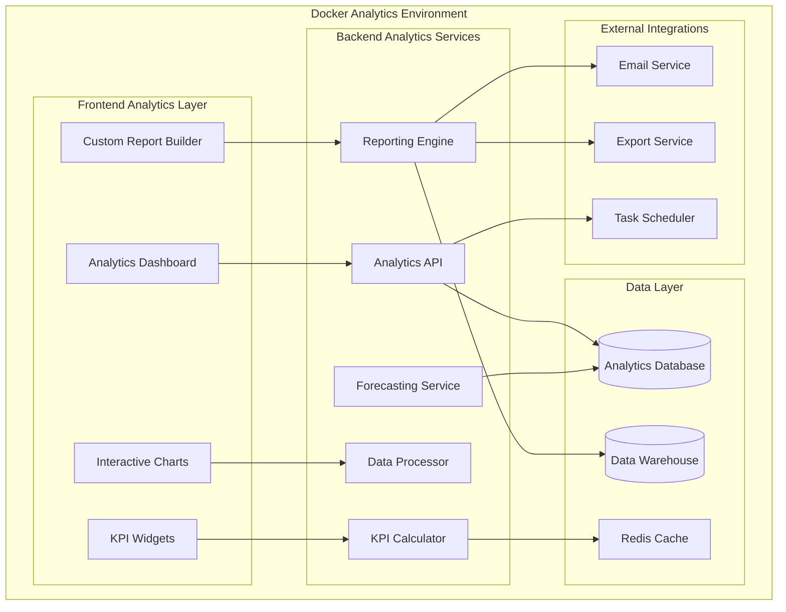
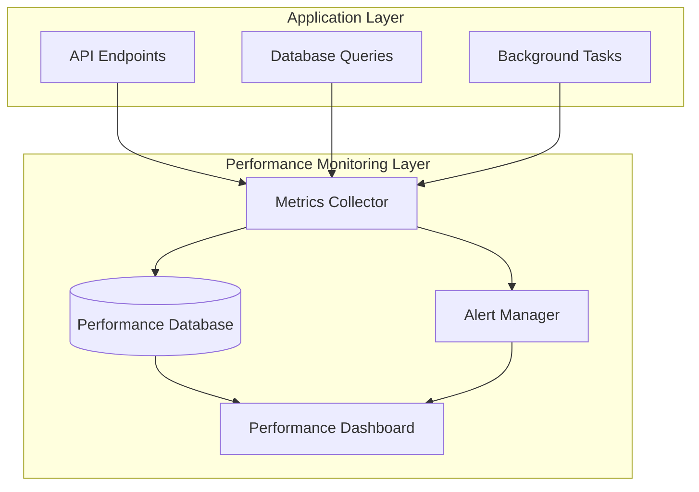
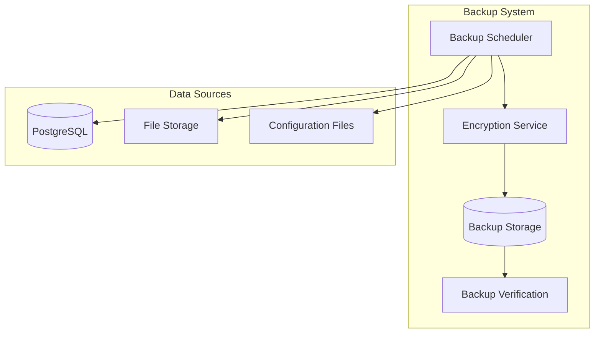
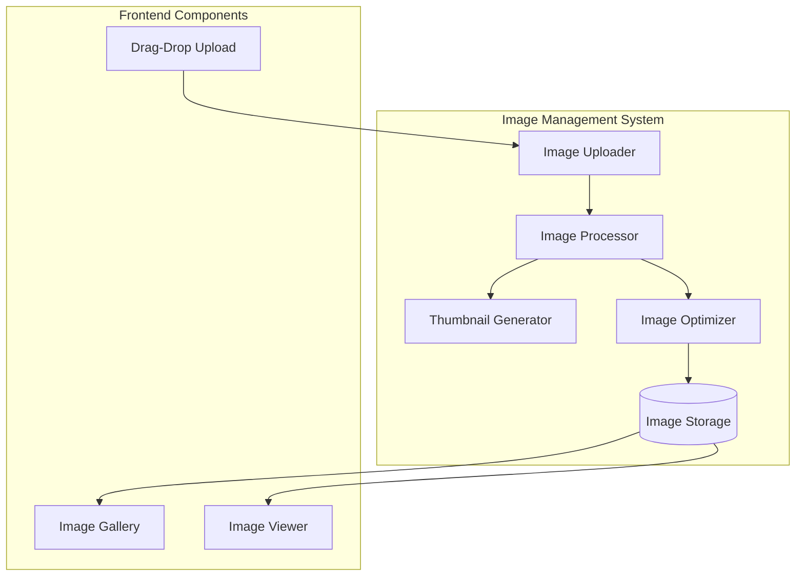

# Design Document

## Overview

The Advanced Analytics & Business Intelligence system transforms the gold shop management platform into a sophisticated data-driven business intelligence solution. The system provides real-time KPI monitoring, intelligent demand forecasting, custom report building with drag-drop interface, and automated insights generation. Built on a modern analytics architecture with Docker containerization, the system ensures scalable performance and enterprise-grade reliability.

## Architecture

### Analytics Architecture



### Technology Stack

**Frontend Analytics:**
- React 18 with TypeScript for component architecture
- Recharts/Chart.js for advanced data visualization
- React DnD for drag-drop report builder interface
- React Query for analytics data caching
- Framer Motion for smooth chart animations
- Date-fns for time series calculations

**Backend Analytics:**
- FastAPI with async processing for analytics endpoints
- Pandas/NumPy for data analysis and calculations
- Scikit-learn for demand forecasting algorithms
- Celery for background analytics processing
- Redis for caching frequently accessed metrics
- PostgreSQL with time-series extensions

**Data Processing:**
- Apache Airflow for ETL pipeline orchestration
- PostgreSQL with TimescaleDB for time-series data
- Redis for real-time KPI caching
- Pandas for data transformation and analysis

## Components and Interfaces

### Frontend Analytics Components

#### KPI Dashboard Component
```typescript
interface KPIDashboard {
  financialKPIs: FinancialKPIWidget[];
  operationalKPIs: OperationalKPIWidget[];
  customerKPIs: CustomerKPIWidget[];
  customKPIs: CustomKPIWidget[];
  timeRange: TimeRangeSelector;
  refreshInterval: number;
}

interface KPIWidget {
  id: string;
  title: string;
  value: number | string;
  target?: number;
  trend: TrendData;
  status: 'success' | 'warning' | 'danger' | 'info';
  sparkline?: number[];
  comparison: ComparisonData;
}

interface TrendData {
  direction: 'up' | 'down' | 'stable';
  percentage: number;
  period: string;
  significance: 'high' | 'medium' | 'low';
}
```

#### Custom Report Builder
```typescript
interface ReportBuilder {
  dataSources: DataSource[];
  availableFields: FieldDefinition[];
  filters: FilterConfiguration[];
  visualizations: VisualizationConfig[];
  layout: ReportLayout;
  scheduling: ScheduleConfig;
}

interface DataSource {
  id: string;
  name: string;
  type: 'table' | 'view' | 'query';
  fields: FieldDefinition[];
  relationships: Relationship[];
}

interface VisualizationConfig {
  type: 'table' | 'chart' | 'metric' | 'text';
  chartType?: 'line' | 'bar' | 'pie' | 'scatter' | 'heatmap';
  dimensions: string[];
  measures: string[];
  styling: ChartStyling;
}
```

#### Interactive Chart Components
```typescript
interface InteractiveChart {
  type: ChartType;
  data: ChartData[];
  config: ChartConfiguration;
  interactions: ChartInteractions;
  animations: AnimationConfig;
  responsive: boolean;
}

interface ChartInteractions {
  drill: DrillDownConfig;
  zoom: ZoomConfig;
  filter: FilterConfig;
  tooltip: TooltipConfig;
  legend: LegendConfig;
}

interface DrillDownConfig {
  enabled: boolean;
  levels: DrillLevel[];
  breadcrumbs: boolean;
}
```

### Backend Analytics Services

#### KPI Calculator Service
```python
class KPICalculatorService:
    def __init__(self, db_session, cache_client):
        self.db = db_session
        self.cache = cache_client
        
    async def calculate_financial_kpis(
        self, 
        time_range: TimeRange,
        targets: Dict[str, float]
    ) -> FinancialKPIs:
        """Calculate comprehensive financial KPIs"""
        
    async def calculate_operational_kpis(
        self,
        time_range: TimeRange
    ) -> OperationalKPIs:
        """Calculate inventory and operational metrics"""
        
    async def calculate_customer_kpis(
        self,
        time_range: TimeRange
    ) -> CustomerKPIs:
        """Calculate customer-related metrics"""
        
    async def get_kpi_trends(
        self,
        kpi_type: str,
        periods: int
    ) -> TrendAnalysis:
        """Analyze KPI trends over time"""
```

#### Forecasting Service
```python
class ForecastingService:
    def __init__(self):
        self.models = {
            'arima': ARIMAModel(),
            'linear_regression': LinearRegressionModel(),
            'seasonal_decompose': SeasonalModel()
        }
    
    async def forecast_demand(
        self,
        item_id: str,
        periods: int,
        model_type: str = 'arima'
    ) -> DemandForecast:
        """Generate demand forecast for inventory items"""
        
    async def analyze_seasonality(
        self,
        sales_data: List[SalesRecord]
    ) -> SeasonalityAnalysis:
        """Identify seasonal patterns in sales data"""
        
    async def calculate_safety_stock(
        self,
        item_id: str,
        service_level: float = 0.95
    ) -> SafetyStockRecommendation:
        """Calculate optimal safety stock levels"""
```

#### Report Engine Service
```python
class ReportEngineService:
    def __init__(self, db_session, export_service):
        self.db = db_session
        self.export_service = export_service
        
    async def build_custom_report(
        self,
        report_config: ReportConfiguration
    ) -> ReportResult:
        """Generate custom report based on configuration"""
        
    async def schedule_report(
        self,
        report_id: str,
        schedule: ScheduleConfig,
        recipients: List[str]
    ) -> ScheduledReport:
        """Schedule automated report generation"""
        
    async def export_report(
        self,
        report_data: ReportData,
        format: ExportFormat
    ) -> ExportResult:
        """Export report in specified format"""
```

## Data Models

### Analytics Data Models

#### KPI Data Models
```python
class FinancialKPI(BaseModel):
    revenue_target: Decimal
    revenue_actual: Decimal
    achievement_rate: float
    profit_margin: float
    cost_ratio: float
    trend_direction: str
    variance_percentage: float
    
class OperationalKPI(BaseModel):
    inventory_turnover: float
    stockout_frequency: float
    carrying_cost_percentage: float
    dead_stock_percentage: float
    order_fulfillment_rate: float
    
class CustomerKPI(BaseModel):
    acquisition_rate: float
    retention_rate: float
    average_transaction_value: Decimal
    customer_lifetime_value: Decimal
    churn_rate: float
```

#### Analytics Database Schema
```sql
-- KPI tracking tables
CREATE TABLE kpi_snapshots (
    id UUID PRIMARY KEY DEFAULT gen_random_uuid(),
    kpi_type VARCHAR(50) NOT NULL,
    kpi_name VARCHAR(100) NOT NULL,
    value DECIMAL(15,4) NOT NULL,
    target_value DECIMAL(15,4),
    period_start TIMESTAMP NOT NULL,
    period_end TIMESTAMP NOT NULL,
    created_at TIMESTAMP DEFAULT CURRENT_TIMESTAMP
);

-- Demand forecasting data
CREATE TABLE demand_forecasts (
    id UUID PRIMARY KEY DEFAULT gen_random_uuid(),
    item_id UUID REFERENCES inventory_items(id),
    forecast_date DATE NOT NULL,
    predicted_demand DECIMAL(10,2) NOT NULL,
    confidence_interval_lower DECIMAL(10,2),
    confidence_interval_upper DECIMAL(10,2),
    model_used VARCHAR(50) NOT NULL,
    accuracy_score DECIMAL(5,4),
    created_at TIMESTAMP DEFAULT CURRENT_TIMESTAMP
);

-- Custom reports configuration
CREATE TABLE custom_reports (
    id UUID PRIMARY KEY DEFAULT gen_random_uuid(),
    name VARCHAR(200) NOT NULL,
    description TEXT,
    configuration JSONB NOT NULL,
    created_by UUID REFERENCES users(id),
    is_scheduled BOOLEAN DEFAULT false,
    schedule_config JSONB,
    created_at TIMESTAMP DEFAULT CURRENT_TIMESTAMP,
    updated_at TIMESTAMP DEFAULT CURRENT_TIMESTAMP
);

-- Analytics cache for performance
CREATE TABLE analytics_cache (
    cache_key VARCHAR(255) PRIMARY KEY,
    data JSONB NOT NULL,
    expires_at TIMESTAMP NOT NULL,
    created_at TIMESTAMP DEFAULT CURRENT_TIMESTAMP
);
```

### Report Configuration Models
```python
class ReportConfiguration(BaseModel):
    name: str
    description: Optional[str]
    data_sources: List[DataSourceConfig]
    filters: List[FilterConfig]
    visualizations: List[VisualizationConfig]
    layout: LayoutConfig
    styling: StylingConfig
    
class DataSourceConfig(BaseModel):
    source_type: str
    table_name: str
    joins: List[JoinConfig]
    fields: List[str]
    
class FilterConfig(BaseModel):
    field: str
    operator: str
    value: Any
    data_type: str
```

## Error Handling

### Analytics Error Handling Strategy

1. **Data Quality Validation**: Comprehensive data validation before processing
2. **Graceful Degradation**: Fallback to cached data when real-time calculation fails
3. **Error Recovery**: Automatic retry mechanisms for failed calculations
4. **User Feedback**: Clear error messages with suggested actions
5. **Monitoring**: Comprehensive logging and alerting for analytics failures

```python
class AnalyticsException(Exception):
    def __init__(self, message: str, error_code: str, details: Dict = None):
        self.message = message
        self.error_code = error_code
        self.details = details or {}

class DataQualityException(AnalyticsException):
    def __init__(self, field: str, issue: str):
        message = f"Data quality issue in field '{field}': {issue}"
        super().__init__(message, "DATA_QUALITY_ERROR", {"field": field, "issue": issue})

class ForecastingException(AnalyticsException):
    def __init__(self, model: str, reason: str):
        message = f"Forecasting failed with model '{model}': {reason}"
        super().__init__(message, "FORECASTING_ERROR", {"model": model, "reason": reason})
```

## Testing Strategy

### Analytics Testing Approach

#### Backend Analytics Testing
```python
# Test KPI calculations with real data
@pytest.mark.asyncio
async def test_financial_kpi_calculation():
    # Setup test data in PostgreSQL
    test_invoices = await create_test_invoices(db_session)
    
    # Calculate KPIs
    kpi_service = KPICalculatorService(db_session, cache_client)
    financial_kpis = await kpi_service.calculate_financial_kpis(
        time_range=TimeRange(start=date.today() - timedelta(days=30), end=date.today()),
        targets={"revenue": 100000, "profit_margin": 0.25}
    )
    
    # Verify calculations
    assert financial_kpis.revenue_actual > 0
    assert 0 <= financial_kpis.achievement_rate <= 2.0
    assert financial_kpis.trend_direction in ['up', 'down', 'stable']

# Test forecasting algorithms
@pytest.mark.asyncio
async def test_demand_forecasting():
    # Create historical sales data
    sales_data = await create_historical_sales_data(db_session)
    
    # Generate forecast
    forecasting_service = ForecastingService()
    forecast = await forecasting_service.forecast_demand(
        item_id=sales_data[0].item_id,
        periods=30,
        model_type='arima'
    )
    
    # Validate forecast results
    assert len(forecast.predictions) == 30
    assert all(pred.value >= 0 for pred in forecast.predictions)
    assert forecast.confidence_score > 0.5
```

#### Frontend Analytics Testing
```typescript
// Test KPI dashboard rendering
describe('KPI Dashboard', () => {
  test('displays financial KPIs correctly', async () => {
    const mockKPIs = {
      revenue: { actual: 50000, target: 60000, trend: 'up' },
      profit_margin: { actual: 0.22, target: 0.25, trend: 'stable' }
    };
    
    render(
      <TestWrapper>
        <KPIDashboard kpis={mockKPIs} />
      </TestWrapper>
    );
    
    await waitFor(() => {
      expect(screen.getByText('Revenue')).toBeInTheDocument();
      expect(screen.getByText('$50,000')).toBeInTheDocument();
      expect(screen.getByText('83.3%')).toBeInTheDocument(); // Achievement rate
    });
  });
  
  test('handles real-time KPI updates', async () => {
    // Test WebSocket updates for real-time KPI changes
    const { rerender } = render(<KPIDashboard />);
    
    // Simulate real-time update
    act(() => {
      mockWebSocket.emit('kpi_update', { revenue: 55000 });
    });
    
    await waitFor(() => {
      expect(screen.getByText('$55,000')).toBeInTheDocument();
    });
  });
});

// Test report builder functionality
describe('Report Builder', () => {
  test('allows drag-drop report creation', async () => {
    render(<ReportBuilder />);
    
    // Test drag and drop functionality
    const fieldElement = screen.getByText('Revenue');
    const dropZone = screen.getByTestId('chart-drop-zone');
    
    fireEvent.dragStart(fieldElement);
    fireEvent.dragOver(dropZone);
    fireEvent.drop(dropZone);
    
    await waitFor(() => {
      expect(screen.getByText('Revenue Chart')).toBeInTheDocument();
    });
  });
});
```

## Performance Optimization

### Analytics Performance Strategy

1. **Data Caching**: Redis caching for frequently accessed KPIs and reports
2. **Query Optimization**: Optimized SQL queries with proper indexing
3. **Background Processing**: Celery for heavy analytics calculations
4. **Data Aggregation**: Pre-calculated aggregations for common metrics
5. **Lazy Loading**: Progressive loading of chart data and visualizations

```python
# Caching strategy for KPIs
class CachedKPIService:
    def __init__(self, cache_client, ttl=300):  # 5-minute cache
        self.cache = cache_client
        self.ttl = ttl
    
    async def get_cached_kpis(self, cache_key: str) -> Optional[Dict]:
        cached_data = await self.cache.get(cache_key)
        if cached_data:
            return json.loads(cached_data)
        return None
    
    async def cache_kpis(self, cache_key: str, kpi_data: Dict):
        await self.cache.setex(
            cache_key, 
            self.ttl, 
            json.dumps(kpi_data, default=str)
        )
```

### Database Optimization
```sql
-- Indexes for analytics performance
CREATE INDEX idx_kpi_snapshots_type_period ON kpi_snapshots(kpi_type, period_start, period_end);
CREATE INDEX idx_demand_forecasts_item_date ON demand_forecasts(item_id, forecast_date);
CREATE INDEX idx_analytics_cache_expires ON analytics_cache(expires_at);

-- Materialized views for common analytics queries
CREATE MATERIALIZED VIEW daily_sales_summary AS
SELECT 
    DATE(created_at) as sale_date,
    COUNT(*) as transaction_count,
    SUM(total_amount) as total_revenue,
    AVG(total_amount) as avg_transaction_value
FROM invoices 
WHERE status = 'completed'
GROUP BY DATE(created_at);

-- Refresh materialized views periodically
CREATE OR REPLACE FUNCTION refresh_analytics_views()
RETURNS void AS $$
BEGIN
    REFRESH MATERIALIZED VIEW daily_sales_summary;
    REFRESH MATERIALIZED VIEW inventory_turnover_summary;
END;
$$ LANGUAGE plpgsql;
```

### Performance Monitoring System

#### Performance Metrics Architecture


#### Performance Monitoring Components
```python
class PerformanceMonitor:
    def __init__(self):
        self.metrics_collector = MetricsCollector()
        self.alert_manager = AlertManager()
        
    async def track_response_time(self, endpoint: str, duration: float):
        """Track API endpoint response times"""
        
    async def monitor_memory_usage(self):
        """Monitor application memory consumption"""
        
    async def track_query_performance(self, query: str, duration: float):
        """Monitor database query performance"""
        
    async def check_system_health(self) -> SystemHealthStatus:
        """Comprehensive system health check"""
```

### Backup & Disaster Recovery System

#### Backup Architecture


#### Backup Service Implementation
```python
class BackupService:
    def __init__(self, encryption_key: str, storage_config: Dict):
        self.encryption = EncryptionService(encryption_key)
        self.storage = BackupStorage(storage_config)
        
    async def create_database_backup(self) -> BackupResult:
        """Create encrypted database backup"""
        
    async def backup_file_storage(self) -> BackupResult:
        """Backup uploaded files and documents"""
        
    async def verify_backup_integrity(self, backup_id: str) -> VerificationResult:
        """Verify backup can be restored successfully"""
        
    async def restore_from_backup(self, backup_id: str) -> RestoreResult:
        """Restore system from backup"""
```

### Enhanced Image Management System

#### Image Processing Architecture


#### Image Management Components
```python
class ImageManagementService:
    def __init__(self):
        self.processor = ImageProcessor()
        self.optimizer = ImageOptimizer()
        self.storage = ImageStorage()
        
    async def upload_image(
        self, 
        file: UploadFile, 
        entity_type: str, 
        entity_id: str
    ) -> ImageUploadResult:
        """Upload and process image for products or categories"""
        
    async def generate_thumbnails(
        self, 
        image_id: str, 
        sizes: List[Tuple[int, int]]
    ) -> List[ThumbnailResult]:
        """Generate multiple thumbnail sizes"""
        
    async def optimize_image(self, image_id: str) -> OptimizationResult:
        """Optimize image for web delivery"""
        
    async def get_image_gallery(
        self, 
        entity_type: str, 
        entity_id: str
    ) -> ImageGallery:
        """Get all images for an entity"""
```

#### Frontend Image Components
```typescript
interface ImageUploadComponent {
  entityType: 'product' | 'category';
  entityId: string;
  maxFiles: number;
  acceptedFormats: string[];
  onUploadComplete: (images: UploadedImage[]) => void;
}

interface ImageGalleryComponent {
  images: GalleryImage[];
  viewMode: 'grid' | 'list';
  enableZoom: boolean;
  enableReorder: boolean;
  onImageSelect: (image: GalleryImage) => void;
}

interface ImageViewerComponent {
  image: GalleryImage;
  enableZoom: boolean;
  enableFullscreen: boolean;
  showMetadata: boolean;
}
```

### Monitoring & Alerting System

#### Alerting Architecture
```python
class AlertingSystem:
    def __init__(self):
        self.alert_rules = AlertRuleEngine()
        self.notification_service = NotificationService()
        
    async def evaluate_alerts(self, metrics: SystemMetrics):
        """Evaluate alert conditions and trigger notifications"""
        
    async def create_alert_rule(self, rule: AlertRule) -> AlertRuleResult:
        """Create new alert rule with conditions and actions"""
        
    async def manage_alert_escalation(self, alert: Alert) -> EscalationResult:
        """Handle alert escalation and acknowledgment"""
```

This comprehensive design provides enterprise-grade analytics, performance monitoring, backup & disaster recovery, and enhanced image management capabilities, all optimized for Docker deployment and production use.