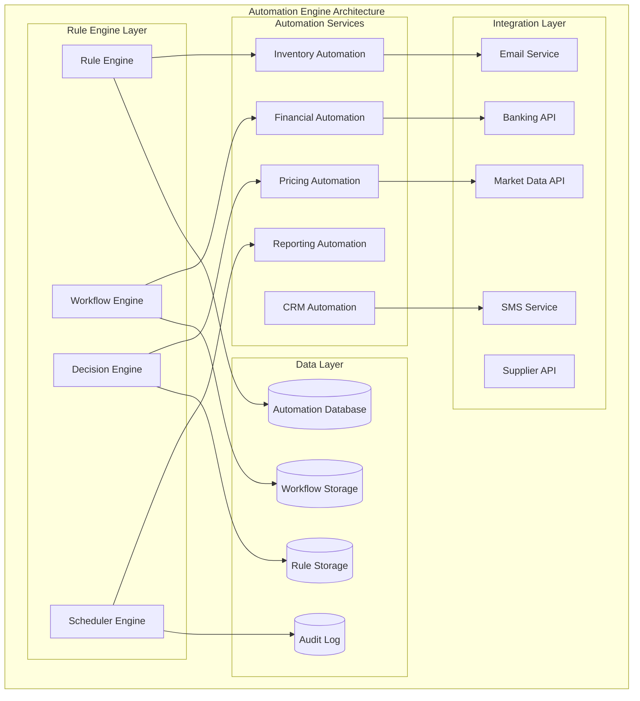

# Design Document

## Overview

The Automation Systems provide comprehensive business process automation for the gold shop management platform. This intelligent automation framework streamlines inventory management, pricing, financial processes, reconciliation, reporting, CRM communications, and loyalty programs through rule-based automation, workflow engines, and intelligent decision-making algorithms. The system is designed for scalability, reliability, and seamless integration with existing business processes.

## Architecture

### Automation Architecture Overview



### Technology Stack

**Automation Framework:**
- Celery with Redis for background task processing
- Apache Airflow for complex workflow orchestration
- Drools-like rule engine for business rule management
- Cron-like scheduling with advanced timing controls
- FastAPI for automation management APIs

**Integration Services:**
- SMTP/SendGrid for email automation
- Twilio/SMS gateway for SMS notifications
- Market data APIs for gold price synchronization
- Banking APIs for payment reconciliation
- Supplier EDI integration for automated ordering

## Components and Interfaces

### Inventory Reorder Automation

#### Automated Reorder Service
```python
class AutoReorderService:
    def __init__(self, db_session, email_service, supplier_api):
        self.db = db_session
        self.email_service = email_service
        self.supplier_api = supplier_api
        self.rule_engine = ReorderRuleEngine()
    
    async def evaluate_reorder_rules(self) -> List[ReorderRecommendation]:
        """Evaluate all inventory items for reorder conditions"""
        items = await self.get_inventory_items()
        recommendations = []
        
        for item in items:
            if await self.should_reorder(item):
                recommendation = await self.calculate_reorder_quantity(item)
                recommendations.append(recommendation)
        
        return recommendations
    
    async def should_reorder(self, item: InventoryItem) -> bool:
        """Determine if item should be reordered based on rules"""
        current_stock = item.stock_quantity
        min_stock = item.min_stock_level
        sales_velocity = await self.calculate_sales_velocity(item.id)
        lead_time = await self.get_supplier_lead_time(item.supplier_id)
        
        # Apply seasonal adjustments
        seasonal_factor = await self.get_seasonal_factor(item.id)
        adjusted_min_stock = min_stock * seasonal_factor
        
        # Calculate reorder point
        reorder_point = adjusted_min_stock + (sales_velocity * lead_time)
        
        return current_stock <= reorder_point
    
    async def create_purchase_order(
        self, 
        recommendation: ReorderRecommendation
    ) -> PurchaseOrder:
        """Create automated purchase order"""
        
    async def send_supplier_notification(
        self, 
        purchase_order: PurchaseOrder
    ) -> NotificationResult:
        """Send automated email to supplier"""

class ReorderRule(BaseModel):
    id: UUID
    item_id: UUID
    min_stock_level: int
    reorder_quantity: int
    lead_time_days: int
    seasonal_adjustments: Dict[str, float]
    supplier_id: UUID
    auto_approve_limit: Decimal
    is_active: bool
```

### Price Update Automation

#### Automated Pricing Service
```python
class AutoPricingService:
    def __init__(self, market_data_api, db_session):
        self.market_api = market_data_api
        self.db = db_session
        self.pricing_engine = PricingEngine()
    
    async def sync_gold_prices(self) -> PriceSyncResult:
        """Sync with market gold prices"""
        current_market_price = await self.market_api.get_current_gold_price()
        
        # Apply margin protection
        protected_price = await self.apply_margin_protection(current_market_price)
        
        # Update base gold price
        await self.update_base_gold_price(protected_price)
        
        # Trigger category price updates
        await self.update_category_prices(protected_price)
        
        return PriceSyncResult(
            market_price=current_market_price,
            applied_price=protected_price,
            updated_items=await self.get_updated_items_count()
        )
    
    async def apply_margin_protection(
        self, 
        market_price: Decimal
    ) -> Decimal:
        """Apply margin protection algorithms"""
        settings = await self.get_pricing_settings()
        min_margin = settings.minimum_profit_margin
        
        # Calculate protected price ensuring minimum margin
        cost_basis = await self.get_average_cost_basis()
        min_price = cost_basis * (1 + min_margin)
        
        return max(market_price, min_price)
    
    async def generate_competitive_alerts(self) -> List[CompetitiveAlert]:
        """Generate competitive pricing alerts"""
        
    async def bulk_update_category_prices(
        self, 
        category_id: UUID, 
        price_adjustment: Decimal
    ) -> BulkUpdateResult:
        """Bulk update prices for category"""

class PricingRule(BaseModel):
    id: UUID
    category_id: Optional[UUID]
    item_id: Optional[UUID]
    pricing_strategy: str  # 'market_based', 'cost_plus', 'competitive'
    margin_percentage: Decimal
    min_margin_percentage: Decimal
    max_price_change_percentage: Decimal
    auto_update_enabled: bool
    approval_required_above: Decimal
```

### Stock Alerts Automation

#### Intelligent Stock Alert System
```python
class StockAlertService:
    def __init__(self, notification_service, analytics_service):
        self.notifications = notification_service
        self.analytics = analytics_service
        self.alert_engine = AlertEngine()
    
    async def evaluate_stock_alerts(self) -> List[StockAlert]:
        """Evaluate all stock alert conditions"""
        alerts = []
        
        # Low stock alerts
        low_stock_items = await self.identify_low_stock_items()
        for item in low_stock_items:
            alert = await self.create_low_stock_alert(item)
            alerts.append(alert)
        
        # Overstock alerts
        overstock_items = await self.identify_overstock_items()
        for item in overstock_items:
            alert = await self.create_overstock_alert(item)
            alerts.append(alert)
        
        # Dead stock alerts
        dead_stock_items = await self.identify_dead_stock()
        for item in dead_stock_items:
            alert = await self.create_dead_stock_alert(item)
            alerts.append(alert)
        
        # Expiry alerts
        expiring_items = await self.identify_expiring_items()
        for item in expiring_items:
            alert = await self.create_expiry_alert(item)
            alerts.append(alert)
        
        return alerts
    
    async def identify_dead_stock(self) -> List[InventoryItem]:
        """Identify dead stock based on sales velocity"""
        cutoff_date = datetime.now() - timedelta(days=90)
        
        items = await self.db.query(InventoryItem).filter(
            InventoryItem.last_sale_date < cutoff_date,
            InventoryItem.stock_quantity > 0
        ).all()
        
        return items
    
    async def send_intelligent_notifications(
        self, 
        alerts: List[StockAlert]
    ) -> NotificationResult:
        """Send prioritized notifications based on alert severity"""

class StockAlert(BaseModel):
    id: UUID
    alert_type: str  # 'low_stock', 'overstock', 'dead_stock', 'expiry'
    item_id: UUID
    severity: str    # 'low', 'medium', 'high', 'critical'
    message: str
    recommended_actions: List[str]
    created_at: datetime
    acknowledged: bool
    acknowledged_by: Optional[UUID]
```

### Financial Process Automation

#### Automated Financial Service
```python
class FinancialAutomationService:
    def __init__(self, db_session, email_service):
        self.db = db_session
        self.email_service = email_service
        self.numbering_service = NumberingService()
        self.tax_calculator = TaxCalculator()
    
    async def generate_invoice_number(
        self, 
        invoice_type: str = 'standard'
    ) -> str:
        """Generate automatic invoice number"""
        settings = await self.get_numbering_settings(invoice_type)
        
        # Format: PREFIX-YYYY-MM-SEQUENCE
        prefix = settings.prefix
        year = datetime.now().year
        month = datetime.now().month
        sequence = await self.get_next_sequence_number(invoice_type, year, month)
        
        return f"{prefix}-{year:04d}-{month:02d}-{sequence:04d}"
    
    async def calculate_automatic_taxes(
        self, 
        invoice_items: List[InvoiceItem]
    ) -> TaxCalculationResult:
        """Calculate taxes automatically based on current rates"""
        total_tax = Decimal('0.00')
        tax_breakdown = {}
        
        for item in invoice_items:
            category = await self.get_item_category(item.inventory_item_id)
            tax_rate = await self.get_tax_rate(category.tax_category)
            
            item_tax = item.total_price * tax_rate
            total_tax += item_tax
            
            if category.tax_category not in tax_breakdown:
                tax_breakdown[category.tax_category] = Decimal('0.00')
            tax_breakdown[category.tax_category] += item_tax
        
        return TaxCalculationResult(
            total_tax=total_tax,
            tax_breakdown=tax_breakdown
        )
    
    async def send_payment_reminders(self) -> ReminderResult:
        """Send automated payment reminders"""
        overdue_invoices = await self.get_overdue_invoices()
        
        for invoice in overdue_invoices:
            days_overdue = (datetime.now().date() - invoice.due_date).days
            reminder_type = self.get_reminder_type(days_overdue)
            
            await self.send_payment_reminder(invoice, reminder_type)
        
        return ReminderResult(reminders_sent=len(overdue_invoices))
    
    async def calculate_late_payment_penalties(
        self, 
        invoice: Invoice
    ) -> PenaltyCalculation:
        """Calculate late payment penalties"""

class NumberingScheme(BaseModel):
    id: UUID
    scheme_type: str  # 'invoice', 'receipt', 'purchase_order'
    prefix: str
    format_pattern: str
    current_sequence: int
    reset_frequency: str  # 'never', 'yearly', 'monthly'
    is_active: bool
```

### Reconciliation Automation

#### Automated Reconciliation Service
```python
class ReconciliationService:
    def __init__(self, db_session, banking_api):
        self.db = db_session
        self.banking_api = banking_api
        self.matching_engine = MatchingEngine()
    
    async def reconcile_bank_transactions(self) -> BankReconciliationResult:
        """Automatically reconcile bank transactions with invoices"""
        bank_transactions = await self.banking_api.get_recent_transactions()
        pending_invoices = await self.get_pending_invoices()
        
        matches = []
        unmatched_transactions = []
        unmatched_invoices = []
        
        for transaction in bank_transactions:
            match = await self.find_invoice_match(transaction, pending_invoices)
            if match:
                matches.append(InvoicePaymentMatch(
                    transaction=transaction,
                    invoice=match,
                    confidence_score=match.confidence
                ))
                pending_invoices.remove(match.invoice)
            else:
                unmatched_transactions.append(transaction)
        
        unmatched_invoices = pending_invoices
        
        return BankReconciliationResult(
            matches=matches,
            unmatched_transactions=unmatched_transactions,
            unmatched_invoices=unmatched_invoices
        )
    
    async def reconcile_inventory(self) -> InventoryReconciliationResult:
        """Reconcile physical inventory with system records"""
        
    async def reconcile_customer_debt(self) -> DebtReconciliationResult:
        """Reconcile customer debt with payment records"""
        
    async def find_invoice_match(
        self, 
        transaction: BankTransaction, 
        invoices: List[Invoice]
    ) -> Optional[InvoiceMatch]:
        """Find matching invoice for bank transaction using intelligent algorithms"""
        
        for invoice in invoices:
            confidence = 0.0
            
            # Amount matching (exact or within tolerance)
            if abs(transaction.amount - invoice.remaining_amount) < Decimal('0.01'):
                confidence += 0.4
            elif abs(transaction.amount - invoice.remaining_amount) < Decimal('1.00'):
                confidence += 0.2
            
            # Date proximity
            days_diff = abs((transaction.date - invoice.created_at.date()).days)
            if days_diff <= 1:
                confidence += 0.3
            elif days_diff <= 7:
                confidence += 0.2
            
            # Reference matching
            if invoice.invoice_number in transaction.description:
                confidence += 0.3
            
            if confidence >= 0.7:  # 70% confidence threshold
                return InvoiceMatch(invoice=invoice, confidence=confidence)
        
        return None

class ReconciliationRule(BaseModel):
    id: UUID
    rule_type: str  # 'bank', 'inventory', 'customer_debt'
    matching_criteria: Dict[str, Any]
    confidence_threshold: float
    auto_approve_threshold: float
    is_active: bool
```

### CRM Communication Automation

#### Automated CRM Service
```python
class CRMAutomationService:
    def __init__(self, email_service, sms_service, template_service):
        self.email_service = email_service
        self.sms_service = sms_service
        self.templates = template_service
        self.segmentation_engine = CustomerSegmentationEngine()
    
    async def send_welcome_messages(self) -> WelcomeMessageResult:
        """Send automated welcome messages to new customers"""
        new_customers = await self.get_new_customers()
        
        for customer in new_customers:
            template = await self.templates.get_welcome_template(customer.language)
            personalized_message = await self.personalize_message(template, customer)
            
            if customer.email:
                await self.email_service.send_email(
                    to=customer.email,
                    subject=personalized_message.subject,
                    body=personalized_message.body
                )
            
            if customer.phone:
                await self.sms_service.send_sms(
                    to=customer.phone,
                    message=personalized_message.sms_body
                )
        
        return WelcomeMessageResult(messages_sent=len(new_customers))
    
    async def send_birthday_greetings(self) -> BirthdayGreetingResult:
        """Send automated birthday greetings with special offers"""
        birthday_customers = await self.get_birthday_customers()
        
        for customer in birthday_customers:
            special_offer = await self.generate_birthday_offer(customer)
            template = await self.templates.get_birthday_template(customer.language)
            
            personalized_message = await self.personalize_birthday_message(
                template, customer, special_offer
            )
            
            await self.send_personalized_message(customer, personalized_message)
        
        return BirthdayGreetingResult(greetings_sent=len(birthday_customers))
    
    async def execute_promotional_campaigns(self) -> CampaignResult:
        """Execute promotional campaign workflows with segmentation"""
        active_campaigns = await self.get_active_campaigns()
        
        results = []
        for campaign in active_campaigns:
            target_customers = await self.segmentation_engine.segment_customers(
                campaign.segmentation_criteria
            )
            
            campaign_result = await self.execute_campaign(campaign, target_customers)
            results.append(campaign_result)
        
        return CampaignResult(campaigns_executed=results)
    
    async def generate_birthday_offer(self, customer: Customer) -> SpecialOffer:
        """Generate personalized birthday offer based on customer history"""

class CommunicationTemplate(BaseModel):
    id: UUID
    template_type: str  # 'welcome', 'birthday', 'payment_reminder', 'promotional'
    language: str
    subject: str
    email_body: str
    sms_body: str
    variables: List[str]  # Available template variables
    is_active: bool
```

### Loyalty Program Automation

#### Automated Loyalty Service
```python
class LoyaltyAutomationService:
    def __init__(self, db_session, notification_service):
        self.db = db_session
        self.notifications = notification_service
        self.points_calculator = PointsCalculator()
        self.tier_manager = TierManager()
    
    async def calculate_loyalty_points(
        self, 
        purchase: Purchase
    ) -> PointsCalculationResult:
        """Automatically calculate loyalty points for purchase"""
        customer = await self.get_customer(purchase.customer_id)
        current_tier = await self.get_customer_tier(customer.id)
        
        # Base points calculation
        base_points = int(purchase.total_amount * current_tier.points_multiplier)
        
        # Bonus points for special categories
        bonus_points = await self.calculate_bonus_points(purchase, current_tier)
        
        total_points = base_points + bonus_points
        
        # Update customer points
        await self.add_points_to_customer(customer.id, total_points)
        
        # Check for tier upgrade
        tier_upgrade = await self.check_tier_upgrade(customer.id)
        
        return PointsCalculationResult(
            base_points=base_points,
            bonus_points=bonus_points,
            total_points=total_points,
            tier_upgrade=tier_upgrade
        )
    
    async def process_tier_upgrades(self) -> TierUpgradeResult:
        """Process automatic tier upgrades"""
        customers = await self.get_customers_eligible_for_upgrade()
        
        upgrades = []
        for customer in customers:
            new_tier = await self.calculate_new_tier(customer)
            if new_tier.level > customer.current_tier.level:
                await self.upgrade_customer_tier(customer.id, new_tier.id)
                await self.activate_tier_benefits(customer.id, new_tier)
                await self.send_tier_upgrade_notification(customer, new_tier)
                
                upgrades.append(TierUpgrade(
                    customer_id=customer.id,
                    old_tier=customer.current_tier,
                    new_tier=new_tier
                ))
        
        return TierUpgradeResult(upgrades=upgrades)
    
    async def send_reward_notifications(self) -> RewardNotificationResult:
        """Send notifications for earned rewards"""
        
    async def process_expired_points(self) -> ExpiredPointsResult:
        """Process expired points and send alerts"""
        expiring_points = await self.get_expiring_points()
        
        for point_record in expiring_points:
            customer = await self.get_customer(point_record.customer_id)
            
            # Send expiry warning
            await self.send_points_expiry_warning(customer, point_record)
            
            # Offer extension if applicable
            extension_offer = await self.generate_extension_offer(customer, point_record)
            if extension_offer:
                await self.send_extension_offer(customer, extension_offer)
        
        return ExpiredPointsResult(
            expiring_points=len(expiring_points),
            extension_offers_sent=len([p for p in expiring_points if p.extension_eligible])
        )

class LoyaltyTier(BaseModel):
    id: UUID
    name: str
    level: int
    points_required: int
    points_multiplier: Decimal
    benefits: List[str]
    discount_percentage: Decimal
    special_offers: List[str]
    is_active: bool
```

## Data Models

### Automation Database Schema

```sql
-- Automation rules and configurations
CREATE TABLE automation_rules (
    id UUID PRIMARY KEY DEFAULT gen_random_uuid(),
    rule_type VARCHAR(50) NOT NULL,
    name VARCHAR(200) NOT NULL,
    description TEXT,
    conditions JSONB NOT NULL,
    actions JSONB NOT NULL,
    is_active BOOLEAN DEFAULT true,
    created_at TIMESTAMP DEFAULT CURRENT_TIMESTAMP,
    updated_at TIMESTAMP DEFAULT CURRENT_TIMESTAMP
);

-- Workflow definitions
CREATE TABLE automation_workflows (
    id UUID PRIMARY KEY DEFAULT gen_random_uuid(),
    workflow_name VARCHAR(200) NOT NULL,
    workflow_type VARCHAR(50) NOT NULL,
    steps JSONB NOT NULL,
    approval_required BOOLEAN DEFAULT false,
    auto_approve_limit DECIMAL(12,2),
    is_active BOOLEAN DEFAULT true,
    created_at TIMESTAMP DEFAULT CURRENT_TIMESTAMP
);

-- Automation execution logs
CREATE TABLE automation_executions (
    id UUID PRIMARY KEY DEFAULT gen_random_uuid(),
    rule_id UUID REFERENCES automation_rules(id),
    workflow_id UUID REFERENCES automation_workflows(id),
    execution_status VARCHAR(20) NOT NULL,
    input_data JSONB,
    output_data JSONB,
    error_message TEXT,
    execution_time INTERVAL,
    executed_at TIMESTAMP DEFAULT CURRENT_TIMESTAMP
);

-- Purchase orders for automated reordering
CREATE TABLE purchase_orders (
    id UUID PRIMARY KEY DEFAULT gen_random_uuid(),
    order_number VARCHAR(50) UNIQUE NOT NULL,
    supplier_id UUID REFERENCES suppliers(id),
    total_amount DECIMAL(12,2) NOT NULL,
    status VARCHAR(20) DEFAULT 'pending',
    auto_generated BOOLEAN DEFAULT false,
    approval_required BOOLEAN DEFAULT false,
    approved_by UUID REFERENCES users(id),
    approved_at TIMESTAMP,
    created_at TIMESTAMP DEFAULT CURRENT_TIMESTAMP
);

-- Communication templates
CREATE TABLE communication_templates (
    id UUID PRIMARY KEY DEFAULT gen_random_uuid(),
    template_type VARCHAR(50) NOT NULL,
    language VARCHAR(10) DEFAULT 'en',
    subject VARCHAR(200),
    email_body TEXT,
    sms_body TEXT,
    variables JSONB,
    is_active BOOLEAN DEFAULT true,
    created_at TIMESTAMP DEFAULT CURRENT_TIMESTAMP
);

-- Loyalty program configuration
CREATE TABLE loyalty_tiers (
    id UUID PRIMARY KEY DEFAULT gen_random_uuid(),
    name VARCHAR(100) NOT NULL,
    level INTEGER NOT NULL,
    points_required INTEGER NOT NULL,
    points_multiplier DECIMAL(3,2) DEFAULT 1.0,
    discount_percentage DECIMAL(5,2) DEFAULT 0.0,
    benefits JSONB,
    is_active BOOLEAN DEFAULT true
);

-- Customer loyalty points
CREATE TABLE customer_loyalty_points (
    id UUID PRIMARY KEY DEFAULT gen_random_uuid(),
    customer_id UUID REFERENCES customers(id),
    points_earned INTEGER NOT NULL,
    points_used INTEGER DEFAULT 0,
    points_balance INTEGER NOT NULL,
    earned_from VARCHAR(100), -- 'purchase', 'bonus', 'referral'
    reference_id UUID, -- Links to purchase, etc.
    expires_at TIMESTAMP,
    created_at TIMESTAMP DEFAULT CURRENT_TIMESTAMP
);
```

## Error Handling

### Automation Error Handling Strategy

```python
class AutomationException(Exception):
    def __init__(self, message: str, automation_type: str, recoverable: bool = True):
        self.message = message
        self.automation_type = automation_type
        self.recoverable = recoverable

class ReorderAutomationException(AutomationException):
    def __init__(self, item_id: str, reason: str):
        super().__init__(
            f"Reorder automation failed for item {item_id}: {reason}",
            "reorder_automation"
        )

class PricingAutomationException(AutomationException):
    def __init__(self, reason: str):
        super().__init__(
            f"Pricing automation failed: {reason}",
            "pricing_automation"
        )

# Automation error recovery
class AutomationErrorHandler:
    async def handle_automation_error(
        self, 
        error: AutomationException, 
        context: Dict
    ):
        # Log error
        await self.log_automation_error(error, context)
        
        # Attempt recovery if possible
        if error.recoverable:
            await self.attempt_error_recovery(error, context)
        
        # Notify administrators
        await self.notify_automation_failure(error, context)
```

## Testing Strategy

### Automation Testing Approach

```python
@pytest.mark.asyncio
async def test_inventory_reorder_automation():
    """Test automated inventory reordering"""
    reorder_service = AutoReorderService(db_session, email_service, supplier_api)
    
    # Create test inventory item with low stock
    test_item = await create_test_inventory_item(
        stock_quantity=5,
        min_stock_level=10,
        reorder_quantity=50
    )
    
    # Run reorder evaluation
    recommendations = await reorder_service.evaluate_reorder_rules()
    
    # Verify reorder recommendation generated
    assert len(recommendations) > 0
    assert recommendations[0].item_id == test_item.id
    assert recommendations[0].recommended_quantity == 50

@pytest.mark.asyncio
async def test_loyalty_points_automation():
    """Test automated loyalty points calculation"""
    loyalty_service = LoyaltyAutomationService(db_session, notification_service)
    
    # Create test customer and purchase
    customer = await create_test_customer()
    purchase = await create_test_purchase(customer_id=customer.id, amount=100.00)
    
    # Calculate loyalty points
    result = await loyalty_service.calculate_loyalty_points(purchase)
    
    # Verify points calculation
    assert result.total_points > 0
    assert result.base_points == 100  # 1 point per dollar
    
    # Verify points added to customer
    updated_customer = await get_customer(customer.id)
    assert updated_customer.loyalty_points == result.total_points
```

This comprehensive automation design provides intelligent business process automation with rule-based decision making, workflow orchestration, and seamless integration across all business functions.