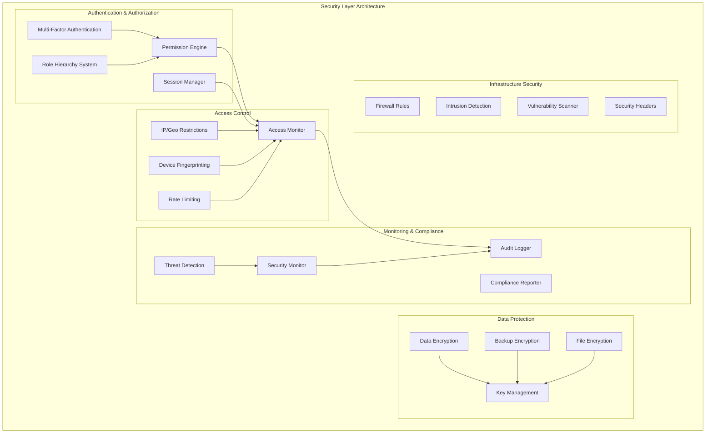

# Design Document

## Overview

The Security & Access Control system provides enterprise-grade security architecture for the gold shop management platform. This comprehensive security framework implements hierarchical role-based access control, multi-factor authentication, advanced session management, data encryption, comprehensive audit logging, and infrastructure security hardening. The system is designed with defense-in-depth principles and follows industry security standards for financial applications.

## Architecture

### Security Architecture Overview



### Technology Stack

**Security Framework:**
- FastAPI Security with OAuth2 and JWT
- Passlib for password hashing (bcrypt/scrypt)
- PyOTP for TOTP multi-factor authentication
- Cryptography library for AES-256 encryption
- Redis for session management and rate limiting
- GeoIP2 for geolocation services

**Infrastructure Security:**
- Docker security best practices
- PostgreSQL with TLS encryption
- Nginx with security headers
- Fail2ban for intrusion prevention
- Let's Encrypt for SSL certificates

## Components and Interfaces

### Enhanced Role Hierarchy System

#### Role Hierarchy Implementation
```python
class RoleHierarchyService:
    def __init__(self, db_session):
        self.db = db_session
        self.hierarchy_cache = {}
    
    async def create_role_hierarchy(self) -> RoleHierarchy:
        """Create hierarchical role structure with inheritance"""
        hierarchy = {
            'owner': {
                'level': 1,
                'inherits_from': None,
                'permissions': ['*'],  # All permissions
                'children': ['manager']
            },
            'manager': {
                'level': 2,
                'inherits_from': 'owner',
                'permissions': ['inventory.*', 'customers.*', 'reports.*'],
                'children': ['accountant', 'supervisor']
            },
            'accountant': {
                'level': 3,
                'inherits_from': 'manager',
                'permissions': ['accounting.*', 'invoices.*', 'reports.financial'],
                'children': ['cashier']
            },
            'cashier': {
                'level': 4,
                'inherits_from': 'accountant',
                'permissions': ['invoices.create', 'customers.read', 'inventory.read'],
                'children': []
            }
        }
        return hierarchy
    
    async def get_effective_permissions(self, role: str) -> List[str]:
        """Get all permissions including inherited ones"""
        
    async def validate_role_assignment(self, user_role: str, target_role: str) -> bool:
        """Validate if user can assign target role based on hierarchy"""
```

#### Role Data Models
```python
class Role(BaseModel):
    id: UUID
    name: str
    level: int
    parent_role_id: Optional[UUID]
    permissions: List[str]
    is_system_role: bool
    created_at: datetime
    updated_at: datetime

class UserRole(BaseModel):
    user_id: UUID
    role_id: UUID
    assigned_by: UUID
    assigned_at: datetime
    expires_at: Optional[datetime]
    is_temporary: bool
```

### Granular Permission System

#### Permission Engine
```python
class PermissionEngine:
    def __init__(self):
        self.permission_cache = PermissionCache()
        self.context_evaluator = ContextEvaluator()
    
    async def check_permission(
        self,
        user_id: UUID,
        resource: str,
        action: str,
        context: PermissionContext
    ) -> PermissionResult:
        """Context-aware permission checking"""
        
    async def evaluate_time_restrictions(
        self,
        permission: Permission,
        current_time: datetime
    ) -> bool:
        """Evaluate time-based access restrictions"""
        
    async def evaluate_data_restrictions(
        self,
        user_id: UUID,
        resource_data: Dict,
        restriction_type: str
    ) -> bool:
        """Evaluate data-level access restrictions"""

class PermissionContext(BaseModel):
    user_id: UUID
    ip_address: str
    location: Optional[GeoLocation]
    device_fingerprint: str
    timestamp: datetime
    resource_data: Dict
    amount_limit: Optional[Decimal]
```

#### Permission Configuration
```python
class Permission(BaseModel):
    id: UUID
    resource: str  # e.g., 'inventory', 'customers', 'invoices'
    action: str    # e.g., 'create', 'read', 'update', 'delete', 'approve'
    conditions: List[PermissionCondition]
    time_restrictions: Optional[TimeRestriction]
    data_restrictions: Optional[DataRestriction]
    amount_limits: Optional[AmountLimit]

class TimeRestriction(BaseModel):
    start_time: Optional[time]
    end_time: Optional[time]
    allowed_days: List[int]  # 0-6 (Monday-Sunday)
    timezone: str

class DataRestriction(BaseModel):
    restriction_type: str  # 'own_data', 'department', 'branch'
    field_filters: Dict[str, Any]
    row_level_security: bool
```

### Multi-Factor Authentication System

#### MFA Implementation
```python
class MFAService:
    def __init__(self):
        self.totp_generator = TOTPGenerator()
        self.sms_service = SMSService()
        self.email_service = EmailService()
    
    async def setup_totp(self, user_id: UUID) -> TOTPSetupResult:
        """Setup TOTP authenticator app"""
        secret = pyotp.random_base32()
        totp_uri = pyotp.totp.TOTP(secret).provisioning_uri(
            name=user.email,
            issuer_name="Gold Shop Management"
        )
        qr_code = self.generate_qr_code(totp_uri)
        return TOTPSetupResult(secret=secret, qr_code=qr_code)
    
    async def verify_totp(self, user_id: UUID, token: str) -> bool:
        """Verify TOTP token"""
        
    async def send_sms_code(self, user_id: UUID) -> SMSResult:
        """Send SMS verification code"""
        
    async def generate_backup_codes(self, user_id: UUID) -> List[str]:
        """Generate backup recovery codes"""

class MFAMethod(BaseModel):
    id: UUID
    user_id: UUID
    method_type: str  # 'totp', 'sms', 'email'
    is_primary: bool
    is_verified: bool
    secret_key: Optional[str]  # Encrypted
    phone_number: Optional[str]
    email: Optional[str]
    backup_codes: List[str]  # Encrypted
    created_at: datetime
```

### Session Security System

#### Enhanced Session Management
```python
class SessionSecurityService:
    def __init__(self, redis_client):
        self.redis = redis_client
        self.device_tracker = DeviceTracker()
        self.anomaly_detector = AnomalyDetector()
    
    async def create_secure_session(
        self,
        user_id: UUID,
        device_info: DeviceInfo,
        ip_address: str
    ) -> SecureSession:
        """Create secure session with device tracking"""
        
    async def validate_session(
        self,
        session_token: str,
        ip_address: str,
        device_fingerprint: str
    ) -> SessionValidationResult:
        """Validate session with security checks"""
        
    async def detect_suspicious_activity(
        self,
        session: SecureSession,
        current_request: RequestInfo
    ) -> SuspiciousActivityResult:
        """Detect suspicious session activity"""
        
    async def enforce_concurrent_session_limit(
        self,
        user_id: UUID,
        max_sessions: int
    ) -> SessionLimitResult:
        """Enforce concurrent session limits"""

class SecureSession(BaseModel):
    session_id: str
    user_id: UUID
    device_fingerprint: str
    ip_address: str
    location: Optional[GeoLocation]
    created_at: datetime
    last_activity: datetime
    expires_at: datetime
    is_suspicious: bool
    security_score: float
```

### Data Encryption System

#### Encryption Service
```python
class EncryptionService:
    def __init__(self, master_key: str):
        self.master_key = master_key
        self.key_manager = KeyManager()
        self.cipher_suite = Fernet(self.master_key)
    
    async def encrypt_database_field(
        self,
        data: str,
        field_type: str
    ) -> EncryptedData:
        """Encrypt sensitive database fields"""
        
    async def encrypt_file(
        self,
        file_path: str,
        encryption_key: Optional[str] = None
    ) -> FileEncryptionResult:
        """Encrypt uploaded files"""
        
    async def encrypt_backup(
        self,
        backup_data: bytes,
        backup_id: str
    ) -> EncryptedBackup:
        """Encrypt backup data"""
        
    async def rotate_encryption_keys(self) -> KeyRotationResult:
        """Rotate encryption keys securely"""

class KeyManager:
    def __init__(self):
        self.key_store = SecureKeyStore()
    
    async def generate_data_key(self, purpose: str) -> DataKey:
        """Generate data encryption key"""
        
    async def get_encryption_key(self, key_id: str) -> EncryptionKey:
        """Retrieve encryption key securely"""
        
    async def rotate_key(self, key_id: str) -> KeyRotationResult:
        """Rotate specific encryption key"""
```

### Comprehensive Audit Logging

#### Audit Logging System
```python
class AuditLogger:
    def __init__(self, db_session):
        self.db = db_session
        self.log_processor = LogProcessor()
    
    async def log_user_action(
        self,
        user_id: UUID,
        action: str,
        resource: str,
        details: Dict,
        ip_address: str
    ) -> AuditLogEntry:
        """Log user actions with full context"""
        
    async def log_data_change(
        self,
        user_id: UUID,
        table_name: str,
        record_id: str,
        old_values: Dict,
        new_values: Dict,
        change_type: str
    ) -> DataChangeLog:
        """Log data modifications with before/after values"""
        
    async def log_authentication_attempt(
        self,
        username: str,
        success: bool,
        ip_address: str,
        user_agent: str,
        failure_reason: Optional[str]
    ) -> AuthenticationLog:
        """Log authentication attempts"""
        
    async def log_api_access(
        self,
        user_id: Optional[UUID],
        endpoint: str,
        method: str,
        status_code: int,
        response_time: float,
        ip_address: str
    ) -> APIAccessLog:
        """Log API access with performance metrics"""

class AuditLogEntry(BaseModel):
    id: UUID
    user_id: Optional[UUID]
    action: str
    resource: str
    resource_id: Optional[str]
    details: Dict
    ip_address: str
    user_agent: str
    timestamp: datetime
    session_id: Optional[str]
    risk_score: float
```

### Advanced Access Control

#### IP and Geo-blocking System
```python
class AccessControlService:
    def __init__(self):
        self.geo_ip = GeoIPService()
        self.rate_limiter = RateLimiter()
        self.device_fingerprinter = DeviceFingerprinter()
    
    async def validate_ip_access(
        self,
        ip_address: str,
        user_id: UUID
    ) -> IPValidationResult:
        """Validate IP address against whitelist/blacklist"""
        
    async def validate_geo_location(
        self,
        ip_address: str,
        allowed_countries: List[str]
    ) -> GeoValidationResult:
        """Validate geographic location"""
        
    async def generate_device_fingerprint(
        self,
        request_headers: Dict,
        user_agent: str
    ) -> DeviceFingerprint:
        """Generate unique device fingerprint"""
        
    async def enforce_rate_limit(
        self,
        user_id: UUID,
        endpoint: str,
        time_window: int,
        max_requests: int
    ) -> RateLimitResult:
        """Enforce API rate limiting"""

class IPRestriction(BaseModel):
    id: UUID
    user_id: Optional[UUID]
    role_id: Optional[UUID]
    ip_address: str
    subnet_mask: Optional[str]
    restriction_type: str  # 'allow', 'deny'
    is_active: bool
    created_at: datetime
    expires_at: Optional[datetime]
```

## Data Models

### Security Database Schema

```sql
-- Enhanced role hierarchy
CREATE TABLE roles (
    id UUID PRIMARY KEY DEFAULT gen_random_uuid(),
    name VARCHAR(50) UNIQUE NOT NULL,
    level INTEGER NOT NULL,
    parent_role_id UUID REFERENCES roles(id),
    permissions JSONB NOT NULL,
    is_system_role BOOLEAN DEFAULT false,
    created_at TIMESTAMP DEFAULT CURRENT_TIMESTAMP,
    updated_at TIMESTAMP DEFAULT CURRENT_TIMESTAMP
);

-- User role assignments with temporary access
CREATE TABLE user_roles (
    id UUID PRIMARY KEY DEFAULT gen_random_uuid(),
    user_id UUID REFERENCES users(id),
    role_id UUID REFERENCES roles(id),
    assigned_by UUID REFERENCES users(id),
    assigned_at TIMESTAMP DEFAULT CURRENT_TIMESTAMP,
    expires_at TIMESTAMP,
    is_temporary BOOLEAN DEFAULT false,
    is_active BOOLEAN DEFAULT true
);

-- Multi-factor authentication
CREATE TABLE mfa_methods (
    id UUID PRIMARY KEY DEFAULT gen_random_uuid(),
    user_id UUID REFERENCES users(id),
    method_type VARCHAR(20) NOT NULL,
    is_primary BOOLEAN DEFAULT false,
    is_verified BOOLEAN DEFAULT false,
    secret_key TEXT, -- Encrypted
    phone_number VARCHAR(20),
    email VARCHAR(100),
    backup_codes JSONB, -- Encrypted array
    created_at TIMESTAMP DEFAULT CURRENT_TIMESTAMP,
    last_used TIMESTAMP
);

-- Session management
CREATE TABLE user_sessions (
    id UUID PRIMARY KEY DEFAULT gen_random_uuid(),
    session_token VARCHAR(255) UNIQUE NOT NULL,
    user_id UUID REFERENCES users(id),
    device_fingerprint VARCHAR(255),
    ip_address INET,
    location JSONB,
    created_at TIMESTAMP DEFAULT CURRENT_TIMESTAMP,
    last_activity TIMESTAMP DEFAULT CURRENT_TIMESTAMP,
    expires_at TIMESTAMP NOT NULL,
    is_suspicious BOOLEAN DEFAULT false,
    security_score DECIMAL(3,2) DEFAULT 1.0
);

-- Comprehensive audit logging
CREATE TABLE audit_logs (
    id UUID PRIMARY KEY DEFAULT gen_random_uuid(),
    user_id UUID REFERENCES users(id),
    action VARCHAR(100) NOT NULL,
    resource VARCHAR(100) NOT NULL,
    resource_id VARCHAR(100),
    details JSONB,
    ip_address INET,
    user_agent TEXT,
    session_id UUID,
    timestamp TIMESTAMP DEFAULT CURRENT_TIMESTAMP,
    risk_score DECIMAL(3,2) DEFAULT 0.0
);

-- Data change tracking
CREATE TABLE data_change_logs (
    id UUID PRIMARY KEY DEFAULT gen_random_uuid(),
    user_id UUID REFERENCES users(id),
    table_name VARCHAR(100) NOT NULL,
    record_id VARCHAR(100) NOT NULL,
    change_type VARCHAR(20) NOT NULL, -- 'INSERT', 'UPDATE', 'DELETE'
    old_values JSONB,
    new_values JSONB,
    timestamp TIMESTAMP DEFAULT CURRENT_TIMESTAMP,
    session_id UUID
);

-- Access control restrictions
CREATE TABLE ip_restrictions (
    id UUID PRIMARY KEY DEFAULT gen_random_uuid(),
    user_id UUID REFERENCES users(id),
    role_id UUID REFERENCES roles(id),
    ip_address INET,
    subnet_mask INTEGER,
    restriction_type VARCHAR(10) NOT NULL, -- 'allow', 'deny'
    is_active BOOLEAN DEFAULT true,
    created_at TIMESTAMP DEFAULT CURRENT_TIMESTAMP,
    expires_at TIMESTAMP
);

-- Encryption key management
CREATE TABLE encryption_keys (
    id UUID PRIMARY KEY DEFAULT gen_random_uuid(),
    key_id VARCHAR(100) UNIQUE NOT NULL,
    key_purpose VARCHAR(50) NOT NULL,
    encrypted_key TEXT NOT NULL,
    created_at TIMESTAMP DEFAULT CURRENT_TIMESTAMP,
    rotated_at TIMESTAMP,
    is_active BOOLEAN DEFAULT true
);
```

## Error Handling

### Security Error Handling Strategy

```python
class SecurityException(Exception):
    def __init__(self, message: str, error_code: str, severity: str = 'medium'):
        self.message = message
        self.error_code = error_code
        self.severity = severity

class AuthenticationException(SecurityException):
    def __init__(self, reason: str):
        super().__init__(f"Authentication failed: {reason}", "AUTH_FAILED", "high")

class AuthorizationException(SecurityException):
    def __init__(self, resource: str, action: str):
        super().__init__(f"Access denied to {resource}:{action}", "ACCESS_DENIED", "high")

class SessionSecurityException(SecurityException):
    def __init__(self, reason: str):
        super().__init__(f"Session security violation: {reason}", "SESSION_VIOLATION", "high")

# Security event handler
@app.exception_handler(SecurityException)
async def security_exception_handler(request, exc: SecurityException):
    # Log security event
    await audit_logger.log_security_event(
        event_type="security_exception",
        severity=exc.severity,
        details={"error_code": exc.error_code, "message": exc.message},
        ip_address=request.client.host
    )
    
    # Return appropriate response without exposing sensitive information
    return JSONResponse(
        status_code=403,
        content={"error": "Access denied", "code": exc.error_code}
    )
```

## Testing Strategy

### Security Testing Approach

#### Authentication & Authorization Testing
```python
@pytest.mark.asyncio
async def test_role_hierarchy_inheritance():
    """Test role permission inheritance"""
    role_service = RoleHierarchyService(db_session)
    
    # Create role hierarchy
    await role_service.create_role_hierarchy()
    
    # Test permission inheritance
    manager_permissions = await role_service.get_effective_permissions('manager')
    cashier_permissions = await role_service.get_effective_permissions('cashier')
    
    # Manager should have more permissions than cashier
    assert len(manager_permissions) > len(cashier_permissions)
    assert all(perm in manager_permissions for perm in cashier_permissions)

@pytest.mark.asyncio
async def test_mfa_totp_verification():
    """Test TOTP multi-factor authentication"""
    mfa_service = MFAService()
    
    # Setup TOTP for user
    setup_result = await mfa_service.setup_totp(user_id)
    assert setup_result.secret is not None
    
    # Generate and verify TOTP token
    totp = pyotp.TOTP(setup_result.secret)
    token = totp.now()
    
    verification_result = await mfa_service.verify_totp(user_id, token)
    assert verification_result is True

@pytest.mark.asyncio
async def test_session_security_validation():
    """Test session security and suspicious activity detection"""
    session_service = SessionSecurityService(redis_client)
    
    # Create session
    session = await session_service.create_secure_session(
        user_id=user_id,
        device_info=device_info,
        ip_address="192.168.1.100"
    )
    
    # Test suspicious activity detection (different IP)
    suspicious_result = await session_service.detect_suspicious_activity(
        session=session,
        current_request=RequestInfo(ip_address="10.0.0.1")
    )
    
    assert suspicious_result.is_suspicious is True
    assert suspicious_result.risk_score > 0.5
```

#### Data Encryption Testing
```python
@pytest.mark.asyncio
async def test_data_encryption_decryption():
    """Test data encryption and decryption"""
    encryption_service = EncryptionService(master_key)
    
    # Test field encryption
    sensitive_data = "customer_credit_card_number"
    encrypted_result = await encryption_service.encrypt_database_field(
        data=sensitive_data,
        field_type="credit_card"
    )
    
    assert encrypted_result.encrypted_data != sensitive_data
    assert encrypted_result.encryption_key_id is not None
    
    # Test decryption
    decrypted_data = await encryption_service.decrypt_database_field(
        encrypted_data=encrypted_result.encrypted_data,
        key_id=encrypted_result.encryption_key_id
    )
    
    assert decrypted_data == sensitive_data

@pytest.mark.asyncio
async def test_audit_logging_completeness():
    """Test comprehensive audit logging"""
    audit_logger = AuditLogger(db_session)
    
    # Test user action logging
    await audit_logger.log_user_action(
        user_id=user_id,
        action="create_invoice",
        resource="invoices",
        details={"invoice_id": "INV-001", "amount": 1000},
        ip_address="192.168.1.100"
    )
    
    # Verify log entry
    log_entries = await audit_logger.get_user_logs(user_id)
    assert len(log_entries) > 0
    assert log_entries[0].action == "create_invoice"
    assert log_entries[0].details["invoice_id"] == "INV-001"
```

## Performance Optimization

### Security Performance Strategy

1. **Permission Caching**: Redis caching for frequently checked permissions
2. **Session Optimization**: Efficient session storage and validation
3. **Encryption Performance**: Hardware-accelerated encryption when available
4. **Audit Log Optimization**: Asynchronous logging with batch processing
5. **Rate Limiting**: Efficient rate limiting with sliding window algorithms

```python
class SecurityPerformanceOptimizer:
    def __init__(self):
        self.permission_cache = PermissionCache(ttl=300)  # 5-minute cache
        self.session_cache = SessionCache(ttl=1800)       # 30-minute cache
    
    async def cached_permission_check(
        self,
        user_id: UUID,
        resource: str,
        action: str
    ) -> bool:
        cache_key = f"perm:{user_id}:{resource}:{action}"
        cached_result = await self.permission_cache.get(cache_key)
        
        if cached_result is not None:
            return cached_result
        
        # Perform actual permission check
        result = await self.permission_engine.check_permission(user_id, resource, action)
        await self.permission_cache.set(cache_key, result)
        
        return result
```

This comprehensive security design provides enterprise-grade protection with defense-in-depth principles, ensuring the gold shop management system meets the highest security standards for financial applications.